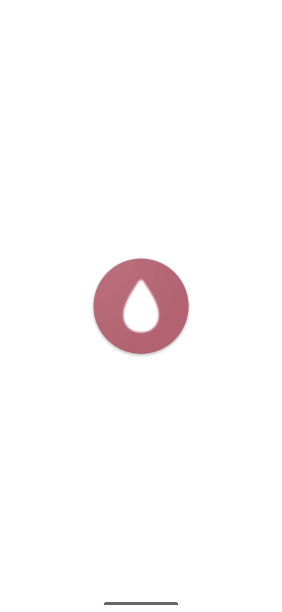

# 🧴👩👨‍🦰 Skeen App

A Mobile Application that helps with your skincare routine.

  Please star⭐ the repo if you like what you see😉.

## ✨ Features

- [x] Schedule notifications to remind you of your skincare routine.
- [x] Reminder for when your skincare products are about to expire.
- [x] Scan or upload skin product ingredients to know if it is right for you.
- [x] Chat with AI to know more about a product.
- [x] Get personal remmonded skincare products based on your desired skin goals.

## 📸 ScreenShots

<!--  -->

| Light                                            | Dark                                            |
| ------------------------------------------------ | ----------------------------------------------- |
|           |          |
|   |    |
|   |   |
|   |   |
|   |   |
|   |   |
|   |   |
|    |   |
|  |  |
|  |  |
|  |  |

## 🔌 Plugins

## Dependencies

| **Dependency**                                                                          | **Usage**                              |
| --------------------------------------------------------------------------------------- | -------------------------------------- | --- |
| [**flutter_riverpod**](https://pub.dev/packages/flutter_riverpod)                       | State management solution              |
| [**flutter_svg**](https://pub.dev/packages/flutter_svg)                                 | SVG image rendering                    |
| [**extended_image**](https://pub.dev/packages/extended_image)                           | Advanced image features                |
| [**fpdart**](https://pub.dev/packages/fpdart)                                           | Functional programming utilities       |
| [**carousel_slider**](https://pub.dev/packages/carousel_slider)                         | Image slider                           |
| [**hive_flutter**](https://pub.dev/packages/hive_flutter)                               | Local storage for persistence          |
| [**permission_handler**](https://pub.dev/packages/permission_handler)                   | Managing app permissions               |
| [**camera**](https://pub.dev/packages/camera)                                           | Camera functionality                   |
| [**image_picker**](https://pub.dev/packages/image_picker)                               | Image and video selection from device  |     |
| [**intl**](https://pub.dev/packages/intl)                                               | Internationalization and localization  |
| [**flutter_calendar_carousel**](https://pub.dev/packages/flutter_calendar_carousel)     | Calendar UI                            |
| [**flutter_local_notifications**](https://pub.dev/packages/flutter_local_notifications) | Local notifications                    |
| [**timezone**](https://pub.dev/packages/timezone)                                       | Timezone support for notifications     |
| [**flutter_secure_storage**](https://pub.dev/packages/flutter_secure_storage)           | Secure key-value storage               |
| [**google_generative_ai**](https://pub.dev/packages/google_generative_ai)               | Google generative AI tools integration |
| [**url_launcher**](https://pub.dev/packages/url_launcher)                               | Launching URLs in the browser or apps  |
| [**firebase_core**](https://pub.dev/packages/firebase_core)                             | Core Firebase SDK initialization       |
| [**firebase_auth**](https://pub.dev/packages/firebase_auth)                             | Firebase authentication services       |
| [**cloud_firestore**](https://pub.dev/packages/cloud_firestore)                         | Cloud Firestore database               |
| [**google_sign_in**](https://pub.dev/packages/google_sign_in)                           | Google Sign-In integration             |
| [**firebase_storage**](https://pub.dev/packages/firebase_storage)                       | Firebase storage for file uploads      |

## 🤓 Author(s)

**Emele-Onu Favour**
[]
(https://x.com/the_fxer)

**Adepitan Oluwatosin**
[]
(https://x.com/tosinSpace)

## Getting Started

This project is a starting point for a Flutter application.

A few resources to get you started if this is your first Flutter project:

- [Lab: Write your first Flutter app](https://docs.flutter.dev/get-started/codelab)
- [Cookbook: Useful Flutter samples](https://docs.flutter.dev/cookbook)

For help getting started with Flutter development, view the
[online documentation](https://docs.flutter.dev/), which offers tutorials,
samples, guidance on mobile development, and a full API reference.
